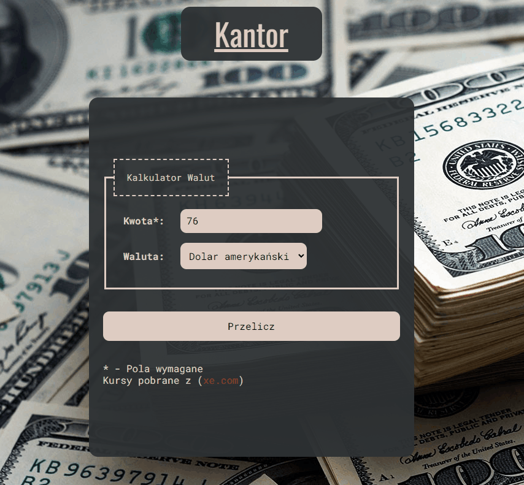

# Currency Converter


## About project

Currency-Converter is a simple calculator to convert currencies with fixed values.

Demo: [click here!](https://siedemus.github.io/currency-converter-react/)

## Currencies
In my converter you can convert PLN to:
- GPB
- USD
- EURO
- CHF

Each currency has been taken from [xe.com](https://www.xe.com/)

## How it works



## Some code

This function convert PLN to currency set by user

```
    const calcResult = (amount, currency) => {
    const cost = currencies.find(curr => curr.short === currency).cost

    setResult({
      fromAmount: +amount,
      currency,
      toAmount: cost * amount
    });
  };
```

## Soon

- More currencies
- Variable currencies

## Technologies I used

- HTML
- CSS
- JavaScript
- BEM
- Normalise.css
- React
- CRA
# Getting Started with Create React App

This project was bootstrapped with [Create React App](https://github.com/facebook/create-react-app).

## Available Scripts

In the project directory, you can run:

### `npm start`

Runs the app in the development mode.\
Open [http://localhost:3000](http://localhost:3000) to view it in your browser.

The page will reload when you make changes.\
You may also see any lint errors in the console.
### `npm run build`

Builds the app for production to the `build` folder.\
It correctly bundles React in production mode and optimizes the build for the best performance.

The build is minified and the filenames include the hashes.\
Your app is ready to be deployed!

See the section about [deployment](https://facebook.github.io/create-react-app/docs/deployment) for more information.